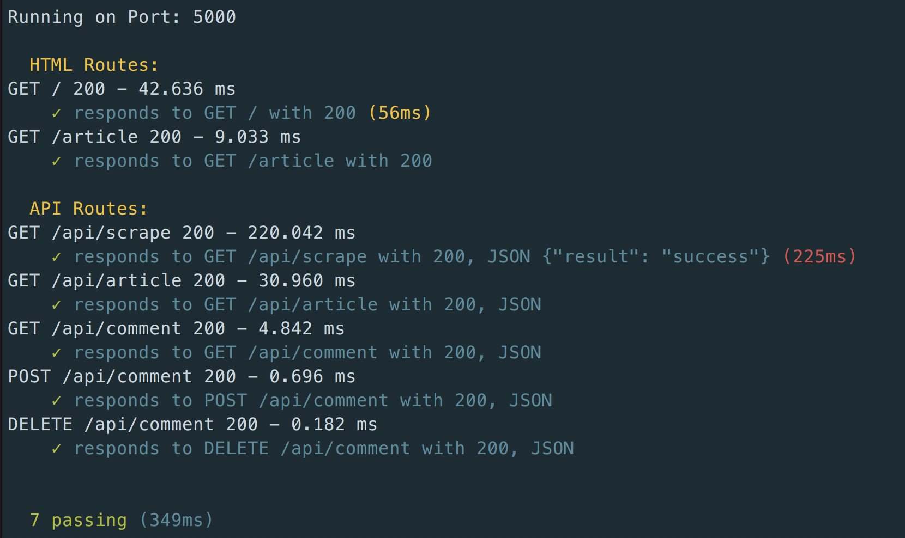

# Scrapeosaurus

#### Try It Now: [Live Page Link](https://scrapeosaurus.herokuapp.com)

 When the button is clicked, the Y Combinator News HTML is fetched by the server. The server will then parse out the front page stories. If the story has no yet been added, then it's saved to a Mongo database.

 Once scraped, the page redirects to the article section where all saved stories can be viewed. Likewise, comments can be added or removed to individual stories. Comments are persisted in Mongo as a nested element in the same collection. 

 ## Technology Used
 Node.js, Express, Express-Handlebars, Mongoose / MongoDB, Cheerio, Request, jQuery

### Middleware Stack
Morgan, Helmet

### Testing and Deployment
Travis CI, Mocha, Supertest, Snyk, Gemnasium, Heroku

